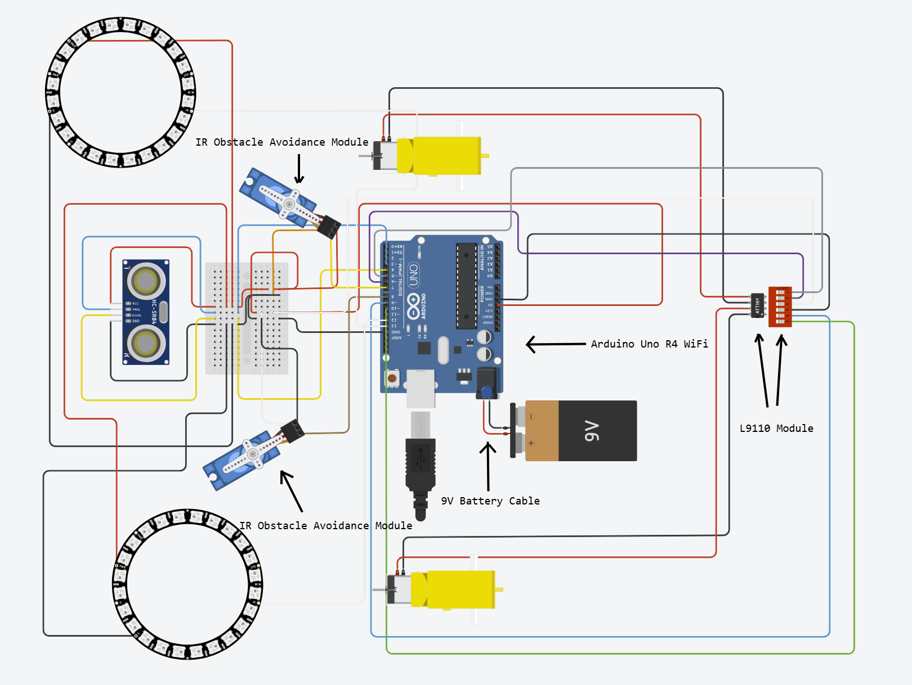

# BlueStamp Floor Cleaning Robot
This project involves a Arduino-controlled self-driving floor-cleaning robot. It uses an ultrasonic sensor and two obstacle avoidance modules to steer out of the way of obstructions. As an extra modification I added remote-controlled LED lights for decoration of the car, which turned out very nice. 

You should comment out all portions of your portfolio that you have not completed yet, as well as any instructions:
```HTML 
<!--- This is an HTML comment in Markdown -->
<!--- Anything between these symbols will not render on the published site -->
```

| **Engineer** | **School** | **Area of Interest** | **Grade** |
|:--:|:--:|:--:|:--:|
| Elijah H | Lynbrook High School | Electrical Engineering | Incoming Sophomore

**Replace the BlueStamp logo below with an image of yourself and your completed project. Follow the guide [here](https://tomcam.github.io/least-github-pages/adding-images-github-pages-site.html) if you need help.**


  
# Final Milestone

**Don't forget to replace the text below with the embedding for your milestone video. Go to Youtube, click Share -> Embed, and copy and paste the code to replace what's below.**

<iframe width="560" height="315" src="https://www.youtube.com/embed/F7M7imOVGug" title="YouTube video player" frameborder="0" allow="accelerometer; autoplay; clipboard-write; encrypted-media; gyroscope; picture-in-picture; web-share" allowfullscreen></iframe>

For your final milestone, explain the outcome of your project. Key details to include are:
- What you've accomplished since your previous milestone
- What your biggest challenges and triumphs were at BSE
- A summary of key topics you learned about
- What you hope to learn in the future after everything you've learned at BSE


# Second Milestone

**Don't forget to replace the text below with the embedding for your milestone video. Go to Youtube, click Share -> Embed, and copy and paste the code to replace what's below.**

<iframe width="560" height="315" src="https://www.youtube.com/embed/y3VAmNlER5Y" title="YouTube video player" frameborder="0" allow="accelerometer; autoplay; clipboard-write; encrypted-media; gyroscope; picture-in-picture; web-share" allowfullscreen></iframe>

My second milestone was the completion of the base project and establishing a good foundation for further modifications. First, I came up with the idea of screwing two mending plates to the front of the car and securing the desktop vacuum in between the two metal pieces. However, I was met with the challenge of trying to balance the weight of the car and not to make it too front-heavy. Eventually, I thought of moving the vacuum and the mending plates to the back of the car, where there was another wheel that prevented the chassis from tipping over. This idea did the trick and I moved on to attaching the ring lights. After this milestone, I am ready to start coding a website that can manually control the LED lights as my final modification. 

# First Milestone

<iframe width="560" height="315" src="https://www.youtube.com/embed/PQ8vPVpIn3M?si=1lPLIXNIFWSRnefL" title="YouTube video player" frameborder="0" allow="accelerometer; autoplay; clipboard-write; encrypted-media; gyroscope; picture-in-picture; web-share" referrerpolicy="strict-origin-when-cross-origin" allowfullscreen></iframe>

My first milestone involved assembling the chassis of the car, testing out the sensors, and coding the basic movement. I first built the chassis of the car and attached the motors. I then wired up the car's battery which allowed for it to drive around. I attached the ultrasonic sensor and obstacle avoidance modules to facilitate its self-driving capabilities. The motors and sensors are all working well through numerous tests of running different code so I am confident that I can move on to the next step. 

# Schematics 



# Code
Here's where you'll put your code. The syntax below places it into a block of code. Follow the guide [here]([url](https://www.markdownguide.org/extended-syntax/)) to learn how to customize it to your project needs. 

```c++
void setup() {
  // put your setup code here, to run once:
  Serial.begin(9600);
  Serial.println("Hello World!");
}

void loop() {
  // put your main code here, to run repeatedly:

}
```

# Bill of Materials

| **Part** | **Note** | **Price** | **Link** |
|:--:|:--:|:--:|:--:|
| Sunfounder Kit | Serves as the base of the floor cleaning robot | $62.99 | <a href="https://www.amazon.com/Arduino-A000066-ARDUINO-UNO-R3/dp/B008GRTSV6/](https://www.amazon.com/SunFounder-Compatible-Tutorials-Including-Controller/dp/B0B778L1DZ/"> Link </a> |
| Double Sided Foam Tape | Sticks items together | $8.09 | <a href="https://www.amazon.com/Mounting-Waterproof-Adhesive-Posters-Sensors/dp/B0DJLR75H9/"> Link </a> |
| Mini desktop vacuum | Cleans the floor | $12.98 | <a href="https://www.amazon.com/dp/B07Q128V6W"> Link </a> |
| 9V Batteries | Powers the robot | $8.88 | <a href="https://www.amazon.com/Amazon-Basics-Performance-All-Purpose-Batteries/dp/B00MH4QM1S/"> Link </a> |
| DMM | Measures electrical signals | $9.99 | <a href="https://www.amazon.com/Amazon-Basics-Performance-All-Purpose-Batteries/dp/B00MH4QM1S/](https://www.amazon.com/dp/B0CXM242J1"> Link </a> |
| AA Batteries | Powers the robot | $9.99 | <a href="https://www.amazon.com/Amazon-Basics-Performance-All-Purpose-Batteries/dp/B00MH4QM1S/](https://www.amazon.com/dp/B0CXM242J1](https://www.amazon.com/Amazon-Basics-Batteries-Leak-Free-Household/dp/B00NTCH52W/"> Link </a> |
| 24 Bits WS2812 LED Ring | Decorative Lights | $8.99 | <a href="https://www.amazon.com/Sparkleiot-Integrated-Drivers-Arduino-Raspberry/dp/B09K58DMMX/"> Link </a> |
| Arduino Uno R4 WiFi | Microcontroller Board | $19.99 | <a href="https://www.amazon.com/DIYables-Development-Compatible-Bluetooth-Prototyping/dp/B0FRZY4YRT/"> Link </a> |

# Other Resources/Examples
One of the best parts about Github is that you can view how other people set up their own work. Here are some past BSE portfolios that are awesome examples. You can view how they set up their portfolio, and you can view their index.md files to understand how they implemented different portfolio components.
- [Example 1](https://trashytuber.github.io/YimingJiaBlueStamp/)
- [Example 2](https://sviatil0.github.io/Sviatoslav_BSE/)
- [Example 3](https://arneshkumar.github.io/arneshbluestamp/)

To watch the BSE tutorial on how to create a portfolio, click here.
